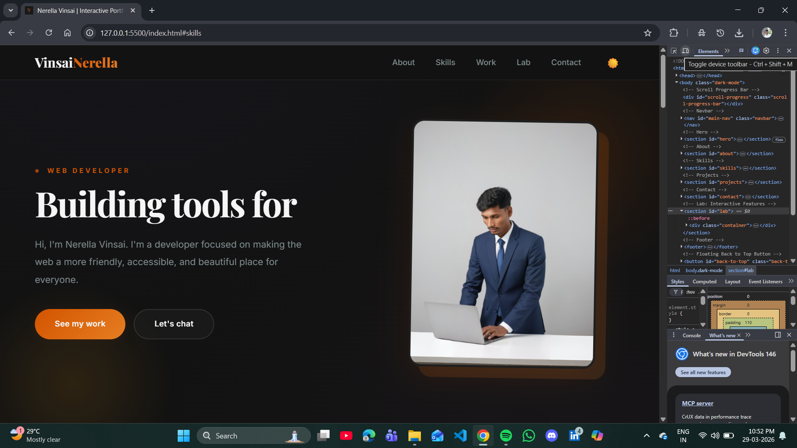
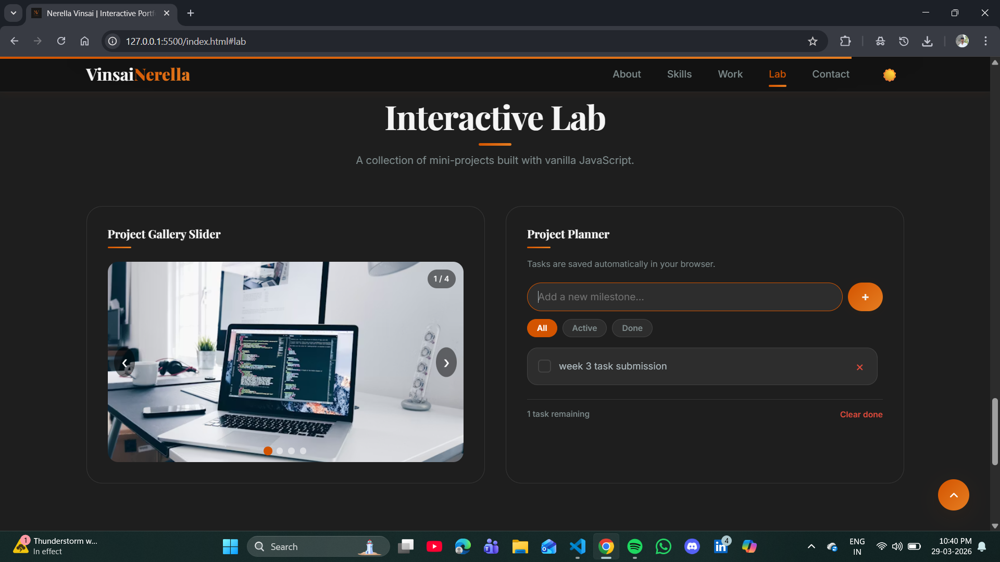
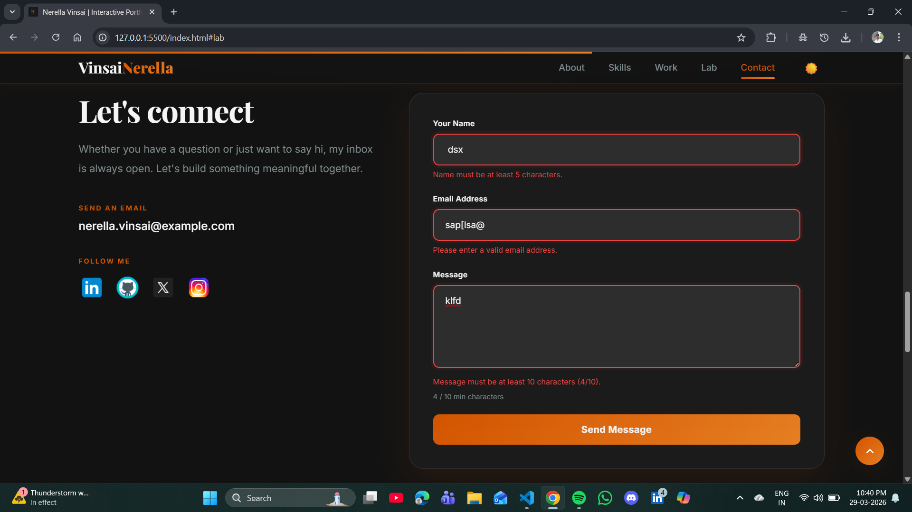
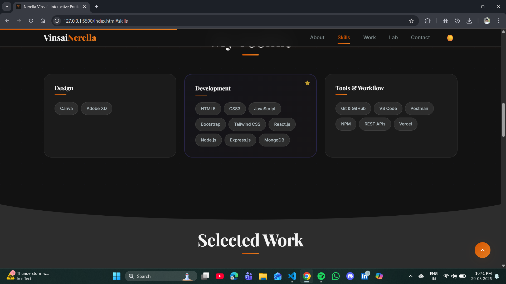
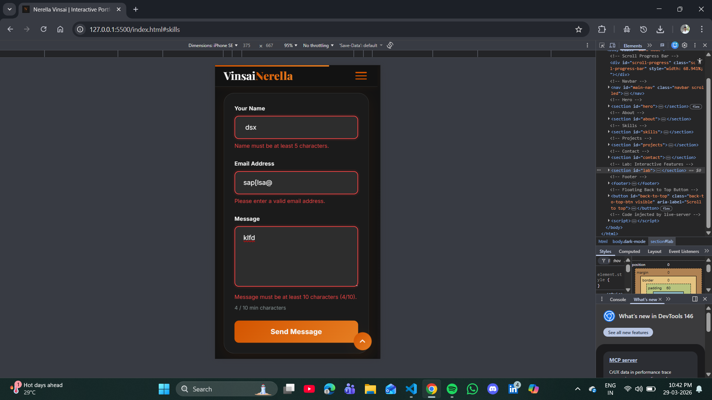
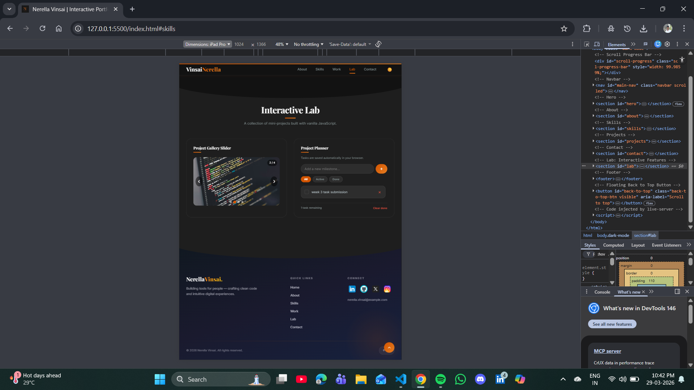
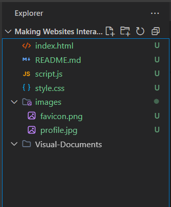

# Interactive Portfolio Website

A fully responsive personal portfolio website enhanced with 11 JavaScript-powered interactive features including form validation, DOM manipulation, event handling, and localStorage persistence. Built entirely with vanilla JavaScript — no frameworks or libraries.

---

## Project Overview

### Goals and Objectives

The goal of this project is to demonstrate mastery of client-side JavaScript by transforming a static portfolio into a dynamic, interactive website. Key objectives include:

- Create an external `script.js` file and link it to `index.html`
- Implement real-time form validation with per-field error messages
- Build multiple interactive features using DOM manipulation
- Use event listeners to respond to user actions (click, scroll, input, keypress, etc.)
- Persist user preferences and data using the localStorage API
- Write clean, reusable functions following best practices

---

## Setup Instructions

### Prerequisites

- A modern web browser (Google Chrome, Firefox, Edge, or Safari)
- A code editor such as VS Code (optional, for viewing/editing code)

### Step-by-Step Installation

1. **Clone the repository**
   ```bash
   git clone https://github.com/Vinsai2003/Interactive-Portfolio-Website
   ```

2. **Navigate to the project folder**
   ```bash
   cd Interactive-Portfolio-Website
   ```

3. **Open in browser**
   - Double-click `index.html`, or
   - Right-click → Open With → your preferred browser
   - No build tools, npm install, or server setup required

### Configuration

- To enable the contact form submission, replace `YOUR_FORMSPREE_ID` in `index.html` (line with `formspree.io`) with your actual Formspree endpoint.
- Dark mode preference and to-do tasks are stored in the browser's localStorage automatically.

---

## Code Structure

```
Making Websites Interactive/
│
├── index.html        → Semantic HTML5 structure with SEO meta tags
├── style.css         → Complete design system, dark mode, responsive layout
├── script.js         → All 11 interactive JavaScript features
├── README.md         → Project documentation (this file)
│
└── images/
│    ├── favicon.png   → Browser tab icon
│   └── profile.jpg   → Hero section profile photo
│
└── Visual-Documents/

```

### File Responsibilities

| File | Role | Key Contents |
|------|------|-------------|
| `index.html` | Structure | Semantic HTML5, accessibility attributes, SEO meta tags, linked CSS/JS |
| `style.css` | Presentation | CSS custom properties, glassmorphism cards, dark mode variables, responsive breakpoints, animations |
| `script.js` | Behaviour | 11 interactive features, event listeners, DOM manipulation, localStorage, form validation, async fetch |

---

## JavaScript Features Implemented

### Navigation System
- Mobile hamburger menu toggle with animated X transformation
- Sticky navbar with glass-blur effect when scrolled past 50px
- Active section highlighting updates automatically as the user scrolls

### Dark / Light Mode Toggle
- Toggles between dark and light themes by swapping CSS custom properties
- Preference saved to `localStorage` — survives browser refresh
- Icon updates dynamically (🌙 → ☀️)

### Scroll Reveal Animations
- Uses `IntersectionObserver` API for efficient scroll-based triggers
- Elements animate in from four directions (up, down, left, right)
- Staggered delays create sequential entrance effects
- Each element reveals only once (observer unsubscribes after trigger)

### Animated Counter
- Stat numbers count up from 0 to their target value when scrolled into view
- Uses `requestAnimationFrame` with ease-out cubic easing for smooth animation
- Duration: 1.5 seconds per counter

### Typing Animation
- Typewriter effect in the hero heading cycling through phrases: *people*, *the web*, *tomorrow*
- Characters are added and removed one at a time with realistic delays
- Typing speed: 120ms, deleting speed: 60ms, pause at full word: 2 seconds

### Show / Hide Content (Read More)
- Toggles extra biography text in the About section
- Button label updates dynamically between "Read More ↓" and "Read Less ↑"
- Content appears with a fade-in CSS animation

### Image Slider
- Previous and Next navigation buttons
- Dot indicators generated dynamically via `createElement`
- Auto-play advances every 4 seconds (resets on user interaction)
- Keyboard navigation with Arrow Left / Arrow Right keys
- Slide counter overlay displays current position (e.g., "1 / 4")

### To-Do List (Project Planner)
- Add new tasks via input field (Enter key or click)
- Mark tasks as complete with custom-styled checkbox toggle
- Delete individual tasks with animated removal
- Filter tabs: All, Active, Completed
- All tasks persist in `localStorage` (survive page refresh)
- Footer shows active task count and "Clear done" bulk action
- User input is escaped via `escapeHtml()` to prevent XSS attacks
- Maximum 100 characters per task

### Form Validation
- **Real-time per-field validation** triggers on `blur` and re-validates on `input`
- Inline error messages appear below each field
- Validation rules:
  - **Name**: Required, minimum 5 characters, letters/spaces/hyphens/apostrophes only
  - **Email**: Required, validated against regex pattern `/^[^\s@]+@[^\s@]+\.[^\s@]+$/`
  - **Message**: Required, minimum 10 characters with live character counter
- Visual feedback: green border for valid fields, red border for invalid
- Submit button shows loading spinner and disables during async submission
- Global success/error banner after form submission via Fetch API

### Scroll Progress Bar
- Fixed gradient bar at the very top of the viewport
- Width dynamically tracks scroll percentage using `scrollY / (scrollHeight - innerHeight)`
- Updates in real-time on every scroll event

### Floating Back-to-Top Button
- Appears with fade + slide animation after scrolling 400px
- Smoothly scrolls to the top of the page on click
- Hidden when near the top of the page

---

## Technical Details

### Architecture

- **Single-page layout** with anchor-based smooth scrolling between sections
- All JavaScript is wrapped inside `DOMContentLoaded` to ensure safe DOM access
- `'use strict'` mode enabled to catch common coding errors
- Modular function design — each feature is self-contained with its own variables and functions

### Algorithms

| Algorithm | Used In | Description |
|-----------|---------|-------------|
| Ease-out cubic | Animated Counter | `1 - Math.pow(1 - progress, 3)` creates deceleration effect |
| Modular arithmetic | Image Slider | `(index + length) % length` enables circular navigation |
| Typewriter loop | Typing Animation | State machine alternating between typing and deleting phases |
| Input sanitisation | To-Do List | `escapeHtml()` creates a text node to neutralise HTML entities |

### Data Structures

| Structure | Location | Schema |
|-----------|----------|--------|
| Tasks array | localStorage (`portfolioTasks`) | `[{ id: number, text: string, done: boolean }]` |
| Phrases array | Typing animation | `['people.', 'the web.', 'tomorrow.']` |
| Dark mode flag | localStorage (`darkMode`) | `'true'` or `'false'` (string) |

### Key JavaScript Concepts Used

- **DOM Manipulation**: `getElementById`, `querySelector`, `querySelectorAll`, `createElement`, `classList`, `innerHTML`, `textContent`
- **Event Listeners**: `click`, `scroll`, `keypress`, `keydown`, `input`, `blur`, `submit`, `change`
- **IntersectionObserver API**: efficient, performant scroll-based animation triggers
- **localStorage API**: client-side persistence for dark mode and to-do tasks
- **Fetch API with async/await**: asynchronous form submission with try/catch error handling
- **requestAnimationFrame**: smooth, frame-rate-synced counter animations
- **Template Literals**: dynamic HTML string generation for to-do items
- **Array Methods**: `filter()`, `forEach()`, `map()`, `push()`
- **Regex**: email pattern matching for form validation

### Security Measures

- User-entered to-do text is escaped using `escapeHtml()` to prevent XSS injection
- Form inputs are validated on the client side before submission
- `novalidate` attribute on the form ensures JavaScript controls all validation
- Server-side validation is handled by Formspree as a second layer

---

## Visual Documentation

### 🖥️ Desktop View (Light Mode)
The full-page desktop layout featuring the hero section, typewriter animation, floating profile image, animated entrance effects, and gradient CTA buttons.



---

### 🌙 Dark Mode
Users toggle between light and dark themes via the 🌙/☀️ button. CSS custom properties swap instantly, and the preference persists across sessions via `localStorage`.


---

### ☀️ Light Mode
The default light theme with full colour palette, glassmorphism cards, and vibrant gradient accents.


---

### 🖼️ Interactive Lab — Image Slider & To-Do List
The interactive lab section displays the image slider with dot navigation / auto-play, and the Project Planner To-Do list with filter tabs (All · Active · Done). All task data persists in `localStorage`.



---

### ✅ Contact Form Validation
Real-time per-field validation displays inline errors below each input. Valid fields show a green border; invalid fields show red. A live character counter tracks the message length and the submit button shows a loading spinner during async submission.



---

### 📊 Scroll Progress Bar
A fixed gradient bar at the very top of the viewport tracks the user's scroll position in real-time.



---

### 📱 Mobile View
Single-column responsive layout with a hamburger navigation menu that slides open on tap. All interactive features remain fully functional on small screens.



---

### 📟 Tablet / iPad View
Two-column grid layout at tablet breakpoints, preserving readability and a premium look across mid-size devices.



---

### 📁 File Structure
Project directory overview showing the clean, minimal three-file architecture (`index.html`, `style.css`, `script.js`) with the `images/` and `Visual-Documents/` folders.



---

## Testing Evidence

### Form Validation Test Cases

| Test Case | Input | Expected Result | Status |
|-----------|-------|-----------------|--------|
| Empty name | (blank) | "Name is required." | ✅ Pass |
| Short name | "Ab" | "Name must be at least 5 characters." | ✅ Pass |
| Invalid name characters | "John123" | "Name can only contain letters..." | ✅ Pass |
| Valid name | "Nerella Vinsai" | Green border, no error | ✅ Pass |
| Empty email | (blank) | "Email is required." | ✅ Pass |
| Invalid email | "test@" | "Please enter a valid email address." | ✅ Pass |
| Valid email | "test@example.com" | Green border, no error | ✅ Pass |
| Empty message | (blank) | "Message is required." | ✅ Pass |
| Short message | "Hello" | "Message must be at least 10 characters (5/10)." | ✅ Pass |
| Valid message | "Hello, I'd like to connect!" | Green border, no error | ✅ Pass |
| All valid + submit | Valid inputs | "🎉 Thanks! Your message has been sent." | ✅ Pass |

### Interactive Feature Tests

| Feature | Test Action | Expected Behaviour | Status |
|---------|------------|-------------------|--------|
| Dark mode | Click 🌙 toggle | Theme switches, icon changes, saved to localStorage | ✅ Pass |
| Dark mode persist | Reload page | Theme remains as set | ✅ Pass |
| Slider next | Click ❯ button | Next image shown, dot updates | ✅ Pass |
| Slider keyboard | Press Arrow Right | Next image shown | ✅ Pass |
| Slider auto-play | Wait 4 seconds | Slides advance automatically | ✅ Pass |
| To-do add | Type + Enter | Task appears in list | ✅ Pass |
| To-do complete | Click checkbox | Task marked with strikethrough | ✅ Pass |
| To-do delete | Click × button | Task removed from list | ✅ Pass |
| To-do persist | Reload page | Tasks remain in list | ✅ Pass |
| To-do filter | Click "Active" tab | Only incomplete tasks shown | ✅ Pass |
| Read more | Click button | Extra text appears, button says "Read Less ↑" | ✅ Pass |
| Counter | Scroll to About | Numbers count up from 0 | ✅ Pass |
| Typing | Load page | Hero text types and deletes in loop | ✅ Pass |
| Progress bar | Scroll down | Top bar width increases | ✅ Pass |
| Back to top | Scroll 400px+ | Floating button appears | ✅ Pass |
| Mobile nav | Click hamburger | Menu slides open | ✅ Pass |

### Browser Compatibility

| Browser | Version Tested | Status |
|---------|---------------|--------|
| Google Chrome | 120+ | ✅ Compatible |
| Mozilla Firefox | 120+ | ✅ Compatible |
| Microsoft Edge | 120+ | ✅ Compatible |
| Safari | 17+ | ✅ Compatible |

---

## Submission Checklist

| Requirement | Status |
|------------|--------|
| `index.html` file | ✅ Included |
| `style.css` file | ✅ Included |
| `script.js` file | ✅ Included |
| `README.md` file | ✅ Included |
| `images/` folder | ✅ Included (favicon.png, profile.jpg) |
| Form validation with error messages | ✅ Real-time per-field validation |
| At least 3 interactive features | ✅ 11 features implemented |
| DOM manipulation to update content | ✅ Counters, typing, to-do, slider |
| Event listeners implemented | ✅ 8 event types used |
| Reusable functions created | ✅ 15+ reusable functions |
| localStorage usage | ✅ Dark mode + to-do persistence |

---

## Author

**Nerella Vinsai**
Web Developer

© 2026 Nerella Vinsai. All rights reserved.
